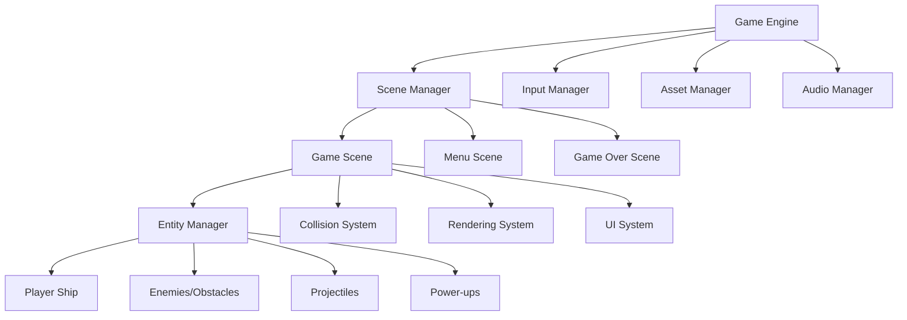

# Space Shooter Game Design Document

## Overview

The space shooter is a retro-style 2D side-scrolling action game built using HTML5 Canvas and TypeScript. The game features a component-based entity system for managing game objects, a state machine for game flow, and a modular weapon system with upgrades. The architecture emphasizes performance, maintainability, and extensibility to support future enhancements.

## Architecture

### High-Level Architecture



### Core Systems

1. **Game Engine**: Central coordinator managing all systems and the game loop
2. **Scene Management**: Handles different game states (menu, gameplay, game over)
3. **Entity Component System**: Manages all game objects with reusable components
4. **Physics/Collision**: Handles movement, collision detection, and response
5. **Rendering**: Manages drawing operations and visual effects
6. **Input**: Processes keyboard/mouse input with configurable controls
7. **Audio**: Manages sound effects and background music
8. **Asset Management**: Loads and caches sprites, sounds, and other resources

## Components and Interfaces

### Core Interfaces

```typescript
interface Entity {
  id: string;
  components: Map<string, Component>;
  active: boolean;
}

interface Component {
  type: string;
  update?(deltaTime: number): void;
}

interface System {
  update(entities: Entity[], deltaTime: number): void;
}
```

### Key Components

#### Transform Component
- Position (x, y)
- Velocity (vx, vy)
- Rotation
- Scale

#### Sprite Component
- Texture reference
- Animation frames
- Current animation state
- Render layer

#### Collider Component
- Collision bounds (rectangle/circle)
- Collision layer/mask
- Collision callbacks

#### Health Component
- Current health
- Maximum health
- Damage immunity frames

#### Weapon Component
- Weapon types array (beam, missile, special)
- Upgrade levels for each weapon
- Ammunition counts
- Fire rates and cooldowns

### Entity Types

#### Player Ship
- Transform, Sprite, Collider, Health, Weapon components
- Input-driven movement with screen boundary constraints
- Three weapon systems with independent upgrade paths

#### Projectiles
- **Beam Projectiles**: Fast, unlimited, basic damage
- **Missile Projectiles**: Slower, limited, high damage, potential homing
- **Special Effects**: Shields, tractor beams, screen-clearing attacks

#### Enemies/Obstacles
- **Static Obstacles**: Move with background scroll, destructible/indestructible
- **Moving Enemies**: AI-driven movement patterns, can fire projectiles
- **Boss Enemies**: Large health pools, multiple attack patterns

#### Power-ups
- **Weapon Upgrades**: Improve specific weapon types
- **Ammunition**: Restore missile counts
- **Special Items**: Temporary shields, score multipliers

## Data Models

### Game State
```typescript
interface GameState {
  score: number;
  lives: number;
  level: number;
  difficulty: number;
  weaponUpgrades: {
    beam: number;
    missile: number;
    special: number;
  };
  ammunition: {
    missiles: number;
    specialUses: number;
  };
}
```

### Weapon System
```typescript
interface WeaponType {
  name: string;
  maxLevel: number;
  fireRate: number;
  damage: number;
  projectileSpeed: number;
  specialProperties: WeaponProperties;
}

interface WeaponProperties {
  piercing?: boolean;
  homing?: boolean;
  explosive?: boolean;
  spread?: number;
}
```

### Level Configuration
```typescript
interface LevelConfig {
  scrollSpeed: number;
  spawnRates: {
    obstacles: number;
    enemies: number;
    powerups: number;
  };
  enemyTypes: string[];
  backgroundLayers: string[];
}
```

## Error Handling

### Collision System
- Graceful handling of edge cases (objects moving off-screen)
- Prevention of duplicate collision events
- Safe removal of destroyed entities

### Asset Loading
- Fallback sprites for missing assets
- Loading progress indicators
- Retry mechanisms for failed loads

### Performance
- Entity pooling to prevent garbage collection spikes
- Efficient collision detection using spatial partitioning
- Frame rate monitoring and adaptive quality settings

### Input Validation
- Sanitization of user input for high scores
- Prevention of rapid-fire exploits
- Graceful handling of controller disconnection

## Testing Strategy

### Unit Testing
- Component behavior testing (movement, collision, weapon firing)
- Weapon upgrade calculations and effects
- Score calculation and progression logic
- Entity lifecycle management

### Integration Testing
- Scene transitions and state management
- Collision system with multiple entity types
- Weapon system integration with projectiles and targets
- Power-up collection and effect application

### Performance Testing
- Frame rate stability with high entity counts
- Memory usage monitoring during extended gameplay
- Asset loading performance optimization
- Collision detection efficiency with spatial optimization

### Gameplay Testing
- Weapon balance and upgrade progression
- Difficulty curve and enemy spawn rates
- Player movement responsiveness and feel
- Visual feedback timing and clarity

## Technical Implementation Details

### Rendering Pipeline
1. Clear canvas
2. Render background layers (parallax scrolling)
3. Render entities by layer (background → gameplay → UI)
4. Apply post-processing effects (screen shake, flash effects)
5. Render UI elements (score, health, ammunition)

### Game Loop
```typescript
function gameLoop(currentTime: number) {
  const deltaTime = currentTime - lastTime;
  
  // Update systems
  inputSystem.update(deltaTime);
  physicsSystem.update(entities, deltaTime);
  collisionSystem.update(entities, deltaTime);
  weaponSystem.update(entities, deltaTime);
  
  // Render
  renderSystem.render(entities);
  uiSystem.render(gameState);
  
  // Cleanup
  entityManager.removeInactiveEntities();
  
  requestAnimationFrame(gameLoop);
}
```

### Weapon Upgrade System
- Each weapon type has independent upgrade paths
- Upgrades modify base weapon properties (damage, fire rate, special effects)
- Visual and audio feedback for upgrade collection
- Maximum upgrade levels with score bonuses for excess upgrades

### Scrolling Background
- Multi-layer parallax scrolling for depth
- Seamless texture tiling
- Dynamic background elements (stars, nebulae)
- Performance optimization through texture atlasing